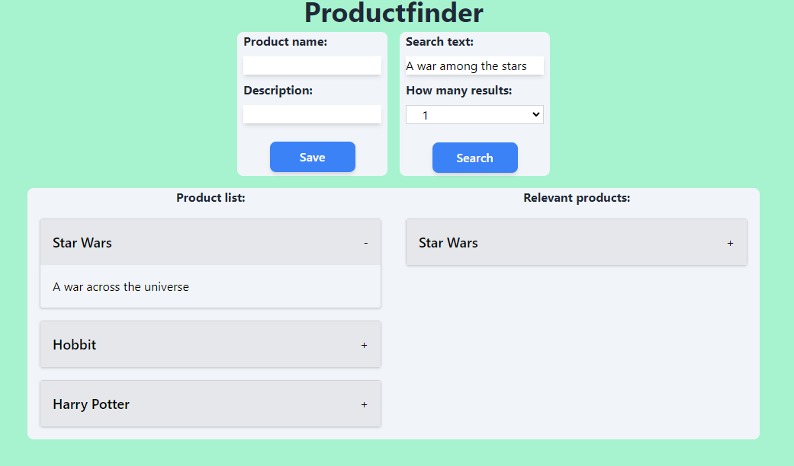

# Productfinder

Productfinder is a powerful and efficient tool designed to help you quickly search for specific products using a vector database. It features a responsive frontend built with React and a lightweight backend powered by FastAPI.

## Features

- **Fast Product Search**: Utilize a vector database to perform rapid searches for products.
- **Lightweight Backend**: A thin backend powered by FastAPI, providing efficient and scalable performance.
- **Responsive Frontend**: A modern, responsive interface built with React and Tailwind to ensure a seamless user experience across devices.
## Example search

    

